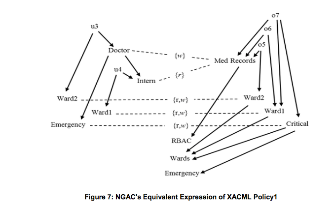
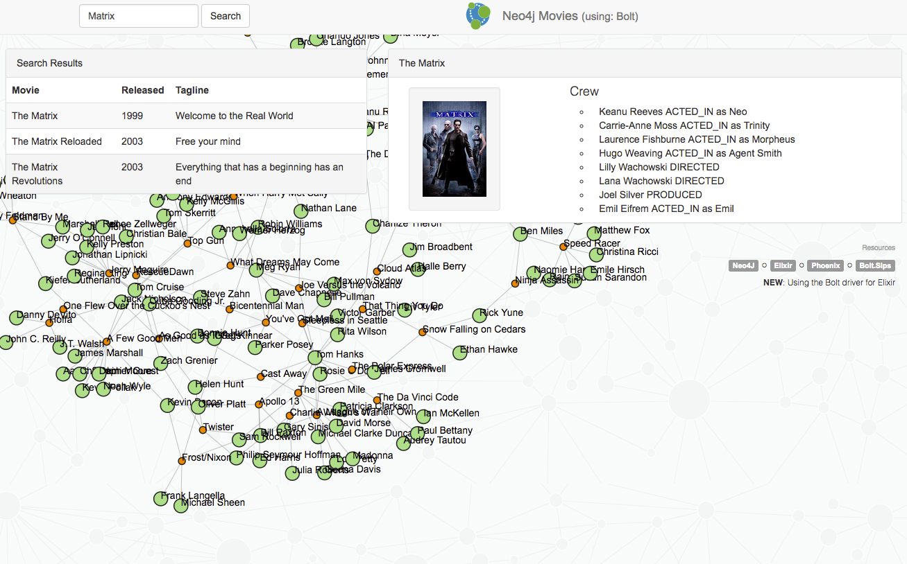
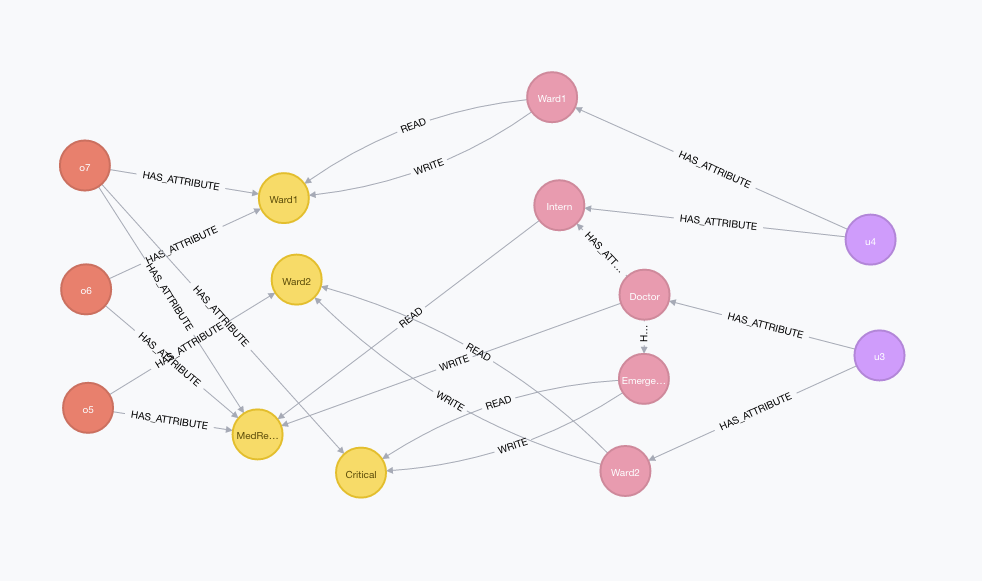

# Using Neo4j from Elixir
## (and Next Generation Access Control)

## Ryo Kajiwara / sylph01
## @ tokyo.ex #7 × 歌舞伎座.tech #13

---


# 自己紹介

* 梶原 龍 / sylph01
    * Github: @sylph01
    * Twitter: @s01
* **ID + IoT = IDIOT** なエンジニアをしています
    * 今日の弊社の発表者3人の中で一番弱い

---

# 今日の話

* 背景
    * Neo4j
    * Next Generation Access Control (NGAC)
* Bolt.Sips
    * サンプル、NGACのサンプル
    * 少々コードリーディング

---

画像が多いので

https://github.com/sylph01/tokyoex_7_lt

を見ながら聞くことをおすすめします

---

# Neo4j

* グラフ志向データベース
    * グラフ構造を永続化できる
    * 類似の傾向を持つものにOrientDB, ArangoDBなど

^ 映画の共演関係とかのグラフがチュートリアルに用意されていてすぐに触れる

---

# Next Generation Access Control(NGAC)

* NISTの提唱するアクセス制御の新しい形態
    * XACMLを置き換えるもの、というイメージ
* ユーザー・ユーザー属性・オブジェクト・オブジェクト属性・ポリシークラスという要素の「関係性」でアクセス制御を実装する
    * これらのノードの関係性がグラフで表現できる

---



^ NIST SP800-178より

---

# NGACでのアクセス可能性

* ユーザーがオブジェクトにある操作が行える、とは、
    * 操作に対応する枝の発生元のユーザー属性がユーザーから辿れる
    * 操作に対応する枝の行き先のオブジェクト属性がオブジェクトから辿れる
    * ユーザー属性から辿れるポリシークラスの集合がオブジェクト属性から辿れるポリシークラスのsupersetである

---


^ 図をもとに説明

---

# なんでNGAC？

XACML(XMLベースのアクセス制御の標準)に比べて:

* グラフを扱うので
    * ポリシー数が増加しても関係ないポリシーの影響を受けずに探索できる
    * 「あるユーザーから操作できるオブジェクトの一覧」を効率よく引くことができる

---

# なんでグラフデータベース？

* グラフ構造をpurely functionalに扱うのは難しい
    * できたとしてメモリ効率・計算量の効率がつらい
* グラフデータベースを使うことでアルゴリズムとデータ構造の問題をデータベース側に投げることができる

^ マサカリ読み

---

---

#[fit] Neo4jを
#[fit] Elixirで

^ そんなわけで本編

---

# Bolt.Sips

https://github.com/florinpatrascu/bolt_sips

[公式サイトからもリンクされている](https://neo4j.com/developer/erlang_elixir/)ドライバ。

* Neo4j 3.x以降のBoltプロトコルに対応
    * REST APIのクライアントには [Neo4j.Sips](
https://github.com/florinpatrascu/neo4j_sips) というのがある

----

# サンプルを動かす

https://github.com/neo4j-examples/bolt_movies_elixir_phoenix

チュートリアルにある映画の共演関係のグラフを使ったサンプル。

* Neo4jインストール後、`neo4j start` でサーバーを立ち上げ
* `mix deps.get`, `mix deps.compile`, `mix phoenix.server`

----



----

# サンプル中の例

```
MATCH (n:Movie {title: \"The Matrix\"})
WITH n MATCH p=(n)-[*0..1]-(m)
RETURN p
```

Phoenixコードは以下:

```elixir
data = Bolt.query!(Bolt.conn, cypher)
{nodes, relationships} = data |> Utils.nodes_and_relationships

render(conn, "search_by_title.json",
  movie: Utils.movie_and_roles(nodes, relationships, title))
```

---

# 少々コードリーディング

`Bolt.Sips.conn` : (Bolt.Sips内) `:poolboy.transaction`を呼んでいる。Poolboyで管理しているプロセスプールからコネクションを引っ張ってくる。

```
iex(1)> Bolt.Sips.conn
#Port<0.6214>
iex(2)> Bolt.Sips.conn
#Port<0.6403>
iex(3)> Bolt.Sips.conn
#Port<0.6404>
```

---

# 少々コードリーディング

`Bolt.Sips.query!` : `query_commit/3` -> `tx/3` に伝搬。`tx/3`はステートメントが複数のときはトランザクションにまとめる働きをする。

実際のクエリの処理はGenServer `Bolt.Sips.Connection` の `handle_call/3`の2つめのbody(本日時点L.50)で行われている。

Boltプロトコルへのステートメントの変換はL.57 `Boltex.Bolt.run_statement/4`。

---

# 少々コードリーディング

データベースドライバには

* connection pool(Bolt.Sips.Connection + poolboy)
* キャッシュ(ConCache)
* トランザクションを束ねるAPI(Bolt.Sips.Query)
* データベースのプロトコルとの変換器(Boltex)

が必要/ほしい。（ここでは括弧内で実装されている）

---

# 少々コードリーディング

`Utils.movie_and_roles` : (サンプルアプリケーション内) 映画を示すノードと関係性をアプリ内で使う形にparse。

実際どういう形式で戻ってくるかは別途示します。

----

# NGACの例をやってみる

とりあえずサンプルからiexで。

データのセットアップはNeo4jのコンソールから手動で行った（ElixirからCypherクエリを投げてもよい）

----



^ 今回はポリシークラスは省略

----

# 例1

u3(Doctor)はo5(Ward2の医療文書)を読み込めるか？

A. Yes。u3はDoctorであり、DoctorはMedRecords(=o5が属す)へのREADを許可されていて、u3はWard2であり、o5もWard2であり、Ward2はWard2へのREADを許可されている。

----

# 例1のクエリ

```
MATCH (u:User {name: "u3"})-[:HAS_ATTRIBUTE*]->
(ua:UserAttribute)-[:READ]->(oa:ObjectAttribute)
<-[:HAS_ATTRIBUTE*]-(o:Object)
RETURN u, ua, oa, o
```

```
MATCH (u:User {name: "u3"})-[:HAS_ATTRIBUTE*]->
(ua:UserAttribute)-[:READ]->(oa:ObjectAttribute)
RETURN u, ua
```

```
MATCH (o:Object {name: "o5"})-[:HAS_ATTRIBUTE*]->
(oa:ObjectAttribute)<-[:READ]-(ua:UserAttribute)
RETURN o, oa
```

----

iex -S mixした上で

```
iex(7)> q = "MATCH (略) \n RETURN u, ua, oa, o"
(略)
iex(8)> Bolt.Sips.query!(Bolt.Sips.conn, q)
[debug] #Port<0.6430> - (略)
[%{"o" => %Bolt.Sips.Types.Node{id: 173, labels: ["Object"],
    properties: %{"name" => "o5"}},
   "oa" => %Bolt.Sips.Types.Node{id: 181, labels: ["ObjectAttribute"],
    properties: %{"name" => "MedRecords"}},
   "u" => %Bolt.Sips.Types.Node{id: 171, labels: ["User"],
    properties: %{"name" => "u3"}},
   "ua" => %Bolt.Sips.Types.Node{id: 178, labels: ["UserAttribute"],
    properties: %{"name" => "Intern"}}},
    ...
```

---

```
%{"o" => %Bolt.Sips.Types.Node{id: 173, labels: ["Object"],
    properties: %{"name" => "o5"}},
   "oa" => %Bolt.Sips.Types.Node{id: 181, labels: ["ObjectAttribute"],
    properties: %{"name" => "MedRecords"}},
   "u" => %Bolt.Sips.Types.Node{id: 171, labels: ["User"],
    properties: %{"name" => "u3"}},
   "ua" => %Bolt.Sips.Types.Node{id: 178, labels: ["UserAttribute"],
    properties: %{"name" => "Intern"}}}
```

MapのListの形で来る。

あとは残りの2つのクエリを実行し、この2つのパスがu->ua、o->oaの全てであるかを確かめればよい。（ほんとは多分1つのクエリでできる…）

----

# 例2

u4(Intern)はo6(Ward1の医療文書)へ書き込めるか？

A. No。u4は確かにWard1だが、InternはWRITE権限を持っていない。

----

# 例2のクエリ

```
MATCH (u:User {name: "u4"})-[:HAS_ATTRIBUTE*]->
(ua:UserAttribute)-[:WRITE]->(oa:ObjectAttribute)
<-[:HAS_ATTRIBUTE*]-(o:Object {name: "o6"})
RETURN u, ua, oa, o
```

```
MATCH (u:User {name: "u4"})-[:HAS_ATTRIBUTE*]->
(ua:UserAttribute)-[:WRITE]->(oa:ObjectAttribute)
RETURN u, ua
```

```
MATCH (o:Object {name: "o6"})-[:HAS_ATTRIBUTE*]->
(oa:ObjectAttribute)<-[:WRITE]-(ua:UserAttribute)
RETURN o, oa
```

----

```
iex(12)> q = (略)
iex(13)> Bolt.Sips.query!(Bolt.Sips.conn, q)
[debug] #Port<0.6645> - (略)
[%{"o" => %Bolt.Sips.Types.Node{id: 174, labels: ["Object"],
    properties: %{"name" => "o6"}},
   "oa" => %Bolt.Sips.Types.Node{id: 183, labels: ["ObjectAttribute"],
    properties: %{"name" => "Ward1"}},
   "u" => %Bolt.Sips.Types.Node{id: 172, labels: ["User"],
    properties: %{"name" => "u4"}},
   "ua" => %Bolt.Sips.Types.Node{id: 180, labels: ["UserAttribute"],
    properties: %{"name" => "Ward1"}}}]
```

---

```
iex(18)> q = "MATCH (o:Object {name: 'o6'})-[:HAS_ATTRIBUTE*]->
  (oa:ObjectAttribute)<-[:WRITE]-(ua:UserAttribute)\n RETURN o, oa"
iex(19)> Bolt.Sips.query!(Bolt.Sips.conn, q)
[debug] #Port<0.6744> - cypher: (略)
[%{"o" => %Bolt.Sips.Types.Node{id: 174, labels: ["Object"],
    properties: %{"name" => "o6"}},
   "oa" => %Bolt.Sips.Types.Node{id: 181, labels: ["ObjectAttribute"],
    properties: %{"name" => "MedRecords"}}},
 %{"o" => %Bolt.Sips.Types.Node{id: 174, labels: ["Object"],
    properties: %{"name" => "o6"}},
   "oa" => %Bolt.Sips.Types.Node{id: 183, labels: ["ObjectAttribute"],
    properties: %{"name" => "Ward1"}}}]
```

WRITEの枝が指しているObjectからObjectAttributeへの枝が2つあるのに、UserからObjectに辿れる枝が1つしかないので、書き込み不可能！

---

# まとめ

* ElixirからNeo4jが触れた
* Elixir+Neo4jでNGACが実装できそう
* Ectoからはまだ使えないらしい。REST APIのほうがEctoから触れるようになりそうとのこと
